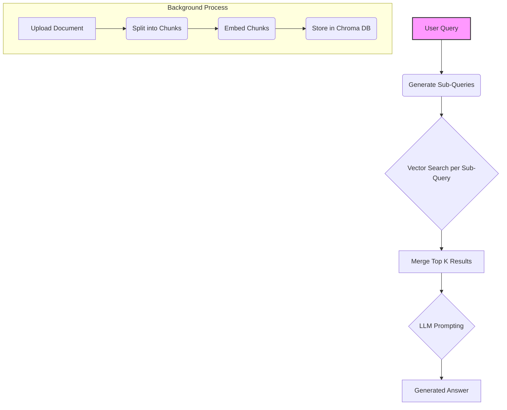

# Graph RAG Project: Graph Rag template start up

## Table of Contents

- [Fusion RAG Project: \[Fusion Rag template start up\]]
  - [Table of Contents](#table-of-contents)
  - [Overview](#overview)
  - [Core Concepts: What is Fusion RAG?](#core-concepts-what-is-fusion-rag)
  - [Project Architecture](#project-architecture)
    - [High-Level Workflow Diagram](#high-level-workflow-diagram)
  - [Core Components](#core-components)
    - [Configuration (`config.py`)](#configuration-configpy)
    - [Document Processing (`document_processing.py`)](#document-processing-document_processingpy)
    - [Embeddings (`embedder.py`)](#embeddings-embedderpy)
    - [Language Model Client (`model_client.py`)](#language-model-client-model_clientpy)
    - [Ingestion Pipeline (`main.py::ingest_pipeline`)](#ingestion-pipeline-mainpyingest_pipeline)
    - [Retrieval Strategy (`retriever.py`)](#retrieval-strategy-retrieverpy)
    - [API Server (`main.py`)](#api-server-mainpy)
    - [Logging](#logging)
  - [**Key Modifiable Components for Reuse**](#key-modifiable-components-for-reuse)
    - [**Ingestion Pipeline Details** (`main.py::ingest_pipeline`)](#ingestion-pipeline-details-mainpyingest_pipeline)
      - [Ingestion Flow Diagram](#ingestion-flow-diagram)
    - [**Retrieval Strategy Details** (`retriever.py`)](#retrieval-strategy-details-retrieverpy)
      - [Retrieval Flow Diagram](#retrieval-flow-diagram)
  - [Setup and Installation](#setup-and-installation)
  - [Usage](#usage)
    - [Running the Server](#running-the-server)
    - [Uploading Documents](#uploading-documents)
    - [Chatting with the RAG](#chatting-with-the-rag)
  - [Configuration Reference](#configuration-reference)
  - [Future Improvements / Considerations](#future-improvements--considerations)

---

## Overview

This project implements a Retrieval-Augmented Generation (RAG) system that uses Fusion-based retrieval. Instead of relying solely on a single vector similarity search, Fusion RAG performs multiple query reformulations and fuses the results into a richer context before passing it to an LLM.

It is optimized for scenarios where a single embedding might not capture all the nuances of a user query. Fusion RAG increases retrieval diversity, reduces missed contexts, and ultimately improves answer quality.

This README provides a comprehensive breakdown of the project's components, data structures, and workflows, aiming to serve as documentation for future reference and potential reuse in other Fusion RAG projects.

## Core Concepts: What is Fusion RAG?

Fusion RAG works as follows:

1. The user query is expanded into multiple sub-queries using prompt-based generation.
2. Each sub-query is used to perform a vector similarity search.
3. The top documents from all sub-queries are merged (fused).

The final set of documents is passed as context to an LLM.

## Project Architecture

The system is built using Python, FastAPI, LangChain, Chromadb, Infermatic AI Embeddings, and a custom Qwen LLM client.

1.  **Ingestion:** Documents (PDF, TXT) are uploaded, split into chunks, embedded, and stored in chromadb. 
2.  **Retrieval:** A user query is embedded. An initial set of relevant chunks is retrieved via vector search. The additional questions are generated. 
3.  **Generation:** The combined retrieved context is formatted and passed to the LLM along with the original query to generate a final answer.

### High-Level Workflow Diagram



## Core Components

### Configuration (`config.py`)

*   **Purpose:** Centralizes all configuration parameters loaded from environment variables (`.env`) and sets default values.
*   **Key Settings:** Logging level/path, File Upload Directory, Embedding Service details (Azure Endpoint/Key, Model Name, Dimension), LLM details (Qwen API URL/Key, Model Name, Generation Parameters), Neo4j Credentials, RAG parameters (Chunk Size/Overlap, Search K, Graph Neighbors), Ingestion parameters (Similarity Threshold, Link Count), NER Model.

### Document Processing (`document_processing.py`)

*   **Purpose:** Loads documents from specified file paths and splits them into manageable chunks.
*   **Libraries:** LangChain (`PyPDFLoader`, `TextLoader`, `RecursiveCharacterTextSplitter`).
*   **Functionality:**
    *   Supports PDF and TXT files.
    *   Uses `RecursiveCharacterTextSplitter` based on `CHUNK_SIZE` and `CHUNK_OVERLAP`.
    *   Adds metadata to each chunk: unique `id` (hash-based), `chunk_index`, `source_document`, `source`, `page`.


### Embeddings (`embedder.py`)

*   **Purpose:** Provides an interface to generate text embeddings using Azure AI Inference.
*   **Service Used:** Infermatic AI Embeddings (`intfloat-multilingual-e5-base` by default, dimension `3072`).
*   **Implementation:** Uses Infermatic Embeddings (wrapped in LangChain-compatible class).
*   **Reusability:** Medium. Specific to Infermatic AI Embeddings. Easily replaceable with other embedding providers (OpenAI, Hugging Face local models, etc.) by creating a similar LangChain-compatible class. The choice of embedding model and dimension (`EMBEDDING_DIMENSION`) is crucial and project-dependent.

### Language Model Client (`model_client.py`)

*   **Purpose:** Provides an interface to interact with the specified Large Language Model.
*   **Service Used:** Custom Qwen API endpoint (`api.totalgpt.ai`).
*   **Implementation:** Creates a custom LangChain `SimpleChatModel` (`CustomChatQwen`) that handles API calls, authentication, payload formatting (including model parameters like temperature, top_k, repetition_penalty), retries, and timeouts.
*   **Reusability:** Medium. Specific to the Qwen API structure. Easily replaceable with other LLM providers (e.g., `ChatOpenAI`, `ChatHuggingFace`) by using their respective LangChain integrations or creating a similar custom client if needed.

### Retrieval Strategy (`fusion_retriever.py`)

*   **Purpose** Generates multiple queries
*   **Service Used** get_fusion_retriever() uses LangChain MultiQueryRetriever
*   **Implementation** Performs independent searches on ChromaDB


### Ingestion Pipeline (`main.py::ingest_pipeline`)

*   **Purpose:** Orchestrates the entire process of adding a document to the knowledge graph. Runs as a background task.
*   **Key Steps:**
    1.  Load and split the document (`document_processing.load_and_split_document`).
    2.  Add chunk documents (text + embeddings) to the `Chromadb` store.
*   **Reusability:** **Medium to High**. This is a core, often customized part.


### API Server (`main.py`)

*   **Purpose:** Exposes the RAG functionality via a REST API using FastAPI.
*   **Endpoints:**
    *   `/upload-context` (POST): Accepts file uploads, saves the file, and triggers the `ingest_pipeline` background task.
    *   `/chat` (POST): Accepts a user message, orchestrates the retrieval (using the graph-enhanced retriever) and generation (using the `CustomChatQwen` client) process via an LCEL chain, and returns the LLM's reply.
*   **Reusability:** High. Standard FastAPI setup. The specific RAG chain logic within `/chat` depends on the chosen retriever and LLM components.

### Logging

*   **Purpose:** Provides consistent logging throughout the application.
*   **Setup (`config.py::setup_logging`):** Configures logging to both the console and a rotating file (`logs/rag_backend.log`). Log level is configurable via `LOG_LEVEL` env var.
*   **Usage:** Other modules get a logger instance via `config.get_logger(__name__)`.
*   **Reusability:** High. Standard Python logging setup.

---

## Setup and Installation

1.  **Prerequisites:**
    *   Python 3.13
    *   Chromadb installed
    *   Access to an AI Embedding service
    *   Access to the custom Qwen LLM API

2.  **Clone the Repository:**
    ```bash
    git clone https://github.com/Svakira/Fusion-RAG-Chatbot.git
    cd Fusion-RAG-Chatbot
    ```

3.  **Create a Virtual Environment (Recommended):**
    ```bash
    python -m venv venv
    source venv/bin/activate # On Windows: venv\Scripts\activate
    ```

4.  **Install Dependencies on root and /rag-backend:**
    ```bash
    pip install -r requirements.txt
    ```
    *Note: You might need `torch`.*

5.  **Configure Environment Variables:**
    Create a `.env` file in the project root directory and populate it with your credentials and settings (refer to `config.py` and the [Configuration Reference](#configuration-reference) section):
    ```dotenv
    # Logging
    LOG_LEVEL=INFO

    # Azure Embeddings (Replace with your actual values)
    INFERMATIC_EMBEDDINGS_ENDPOINT="https://api.totalgpt.ai/v1/embeddings"
    EMBEDDING_MODEL="intfloat-multilingual-e5-base" # Or text-embedding-3-small

    # Qwen LLM (Replace with your actual values)
    QWEN_API_URL="https://api.totalgpt.ai/v1/chat/completions" # Or your specific URL
    INFERMATIC_API_KEY="YOUR-API-KEY"
    MODEL_NAME="Sao10K-72B-Qwen2.5-Kunou-v1-FP8-Dynamic" # Or your specific model

    # Optional: Adjust RAG/Ingestion parameters if needed
    # CHUNK_SIZE=1000
    # CHUNK_OVERLAP=200
    # TOP_K_INITIAL_SEARCH=5
    # GRAPH_CONTEXT_NEIGHBORS=2 # Reduced from 5 in code, adjust as needed
    # INGEST_SIMILARITY_THRESHOLD=0.80
    # INGEST_SIMILAR_NEIGHBORS_TO_LINK=5
    # INGEST_ENABLE_INTRA_DOC_SIMILARITY="true" # or "false"
    # ENTITY_LABELS_TO_EXTRACT='["PER", "ORG", "LOC"]' # JSON-style list as string


    ```

---

## Usage

### Running the Server

Start the FastAPI application in the **rag_backend directory**:

```bash
python main.py
```

*   The API will be available at `http://localhost:8000`.

### Uploading Documents

Send a POST request with a file (`.pdf` or `.txt`) to the `/upload-context` endpoint.

**Example using `curl`:**

```bash
curl -X POST -F "file=@/path/to/your/document.pdf" http://localhost:8000/upload-context
```

**Response:**

```json
{
  "status": "processing",
  "message": "File 'document.pdf' received and scheduled for ingestion.",
  "document_id": "doc_document_pdf"
}
```

Ingestion happens in the background. Monitor the logs (`logs/rag_backend.log` and console output) to track progress.

### Chatting with the RAG

Send a POST request with the user's message to the `/chat` endpoint the method is x-www-form-urlencoded with the key `message`.

**Example using `curl`:**

```bash
curl -X POST -F "message=What is the main topic discussed in document X?" http://localhost:8000/chat
```

**Response:**

```json
{
  "reply": "Based on the provided context, the main topic discussed in document X is..."
}
```
Or, if the information isn't found:
```json
{
  "reply": "I cannot answer based on the information available in the provided context."
}
```

---

## Configuration Reference

These parameters can be set via environment variables or directly in `config.py`.

*   `INFERMATIC_API_KEY`: Your LLM provider key.
*   `MODEL_NAME`: Qwen or other model used for generation.
*   `HF_MODEL_NAME`: Hugging Face model for NER.
*   `CHUNK_SIZE / OVERLAP`: How document is chunked.
*   `ENTITY_LABELS_TO_EXTRACT`: What types of entities to extract.

---

## Future Improvements / Considerations

*   Swap MultiQueryRetriever with ParentDocumentRetriever or others.
*   Implement re-ranking after retrieval.
*   Allow control over number of sub-queries (e.g., 3 vs 10).
*   Use external summarizers (e.g., MapReduceDocumentsChain).
*   Combine Fusion + Graph RAG in hybrid mode.


